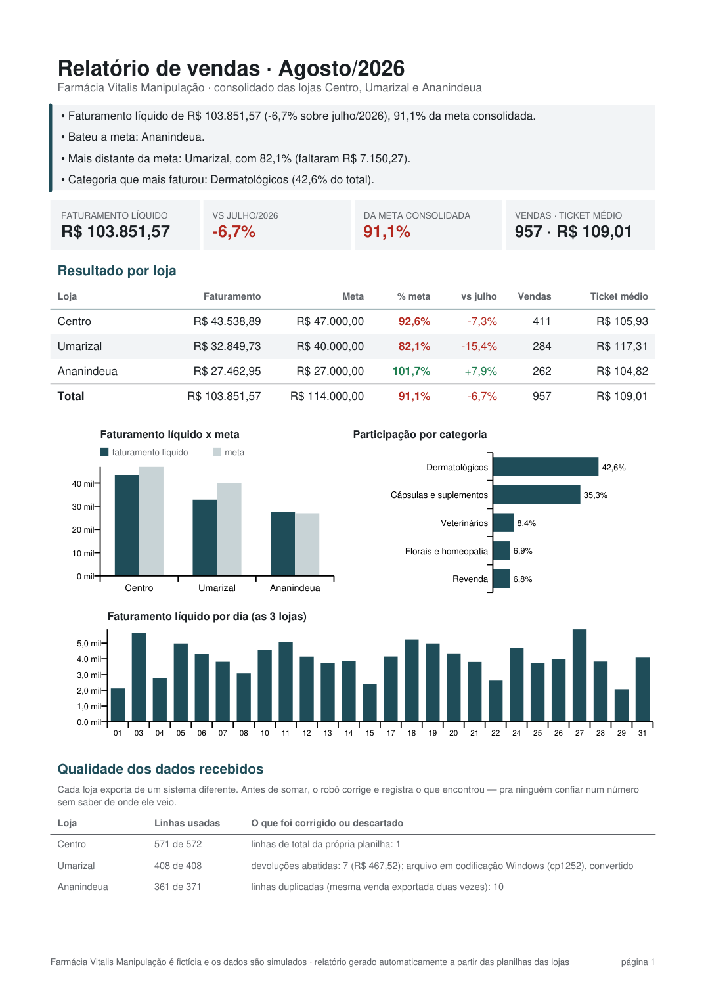
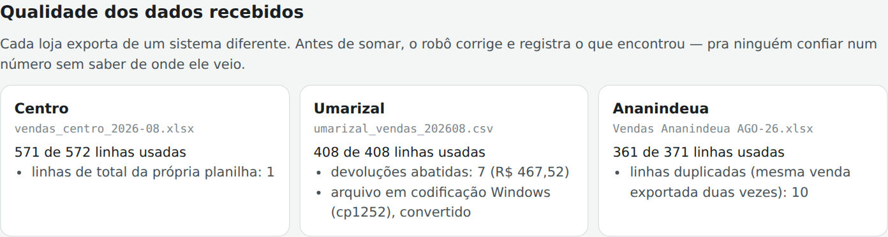
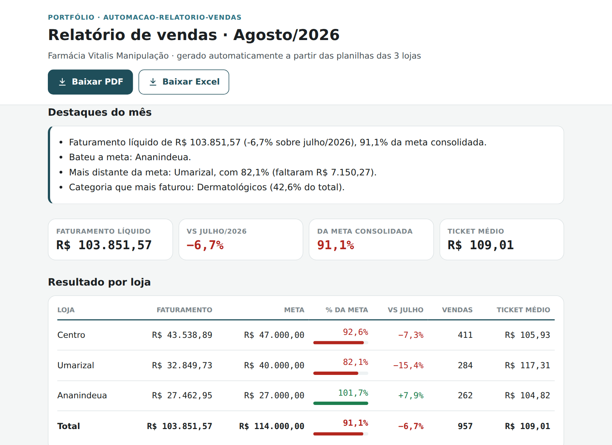

# Automação de Relatório de Vendas (3 lojas, 3 formatos de planilha)

Projeto de portfólio: um robô em Python que junta as planilhas de vendas
de três lojas — cada uma exportada de um sistema diferente, com os
problemas que isso traz na vida real — e gera sozinho o relatório mensal
da gerência em **PDF**, **Excel** e numa **página web**.

**Publicado em [automacao-relatorio-vendas.vercel.app](https://automacao-relatorio-vendas.vercel.app)**
— atualiza sozinho quando as planilhas de um mês novo chegam ao repositório.

<p align="center">
  
</p>

> **Em resumo (pra quem não é da área técnica):** todo fim de mês alguém
> da empresa junta à mão as planilhas das lojas, copia, cola, confere e
> monta o relatório — horas de trabalho, com risco de erro. Este projeto
> faz isso sozinho: as lojas mandam as planilhas do jeito que o sistema
> delas exporta, e em segundos sai o relatório pronto, com o resultado de
> cada loja contra a meta, a comparação com o mês anterior e um resumo
> em frases do que importa. E ele avisa quando alguma planilha veio com
> problema — em vez de somar errado sem ninguém perceber.

## O problema de verdade: cada loja manda de um jeito

O cenário é uma farmácia de manipulação fictícia com três lojas em
Belém. Os problemas das planilhas não são inventados pra dificultar —
são os que aparecem quando cada unidade usa um sistema diferente:

| Loja | Como a planilha chega | O que daria errado sem tratamento |
|---|---|---|
| **Centro** (Excel) | 3 linhas de título antes da tabela; coluna com nome do cliente; linha "TOTAL GERAL" no fim | A soma direta inclui a linha de total: o Centro aparece com **R$ 87.077,78 — o dobro do real** |
| **Umarizal** (CSV) | Acentos em codificação do Windows; `;` como separador; vírgula decimal; devoluções com valor negativo | O arquivo **nem abre** do jeito padrão (erro de codificação) |
| **Ananindeua** (Excel) | Colunas com outros nomes; valor como texto (`"R$ 1.234,56"`); categorias escritas diferente (`DERMATO`, `VET`...); linhas duplicadas | As duplicatas somam **R$ 661,59 a mais** e as categorias não batem com as das outras lojas |

O robô corrige cada um desses casos e **registra o que corrigiu** — essa
lista aparece no próprio relatório, na seção "Qualidade dos dados".
Ninguém precisa confiar num número sem saber de onde ele veio.

<p align="center">
  
</p>

## Como a automação funciona

```
entrada/2026-08/                      saida/2026-08/
  vendas_centro_2026-08.xlsx    ──┐     relatorio.pdf    -> resumo executivo (1 página)
  umarizal_vendas_202608.csv    ──┼──►  relatorio.xlsx   -> mesmos números + vendas por dia + todas as vendas, pra filtrar
  Vendas Ananindeua AGO-26.xlsx ──┘     resumo.json      -> os números em formato de dados
entrada/metas.csv                     public/            -> página + PDF + Excel publicados
```

1. As planilhas do mês vão pra uma pasta `entrada/AAAA-MM/`.
2. Ao enviar pro GitHub, o **GitHub Actions** roda o robô, gera o
   relatório e publica — sem ninguém rodar nada.
3. A Vercel republica a página, com os botões pra baixar o PDF e o Excel.

<p align="center">
  
</p>

Pra rodar na própria máquina:

```bash
pip install -r requirements.txt
cd scripts
python gerar_relatorio.py            # todos os meses em entrada/
python gerar_relatorio.py 2026-08    # só um mês
```

## O que o relatório mostra

- **Destaques em frases**, gerados automaticamente: faturamento do mês
  contra o anterior e contra a meta, quem bateu a meta, quem ficou mais
  longe e quanto faltou, categoria que mais vendeu.
- **Resultado por loja**: faturamento líquido (vendas menos devoluções),
  meta, % da meta, variação sobre o mês anterior, número de vendas e
  ticket médio.
- **Participação por categoria** e **faturamento por dia**.
- **Qualidade dos dados**: por loja, quantas linhas foram usadas e o que
  foi corrigido ou descartado.

O **Excel** traz os mesmos números em quatro abas que se explicam
sozinhas — cada uma com título e uma frase dizendo o que ela mostra:

| Aba | O que tem |
|---|---|
| **Resumo** | Destaques, indicadores, resultado por loja com a situação de cada uma ("Meta batida" / "Faltaram R$ ..."), categorias, dois gráficos e um bloco "Como ler estes números" explicando cada termo |
| **Vendas por dia** | Uma coluna por loja, dia da semana, total do dia e do mês, e gráfico empilhado por loja |
| **Todas as vendas** | Cada item vendido ou devolvido, já corrigido e no mesmo formato pras três lojas, com filtro em cada coluna |
| **Qualidade dos dados** | Uma linha por problema encontrado: o que foi encontrado, o que o robô fez e por que importa, em reais quando dá pra calcular ("Se fosse somada, a loja apareceria com R$ 43.538,89 a mais") |

Todas as abas saem prontas pra imprimir (cabem na largura da folha, e as
tabelas longas repetem o cabeçalho em cada página).

## Feito pra planilha real, não pra planilha de exemplo

Além dos problemas das planilhas de exemplo, o robô foi testado contra os
problemas que aparecem com o tempo — e em nenhum deles ele trava ou soma
errado em silêncio:

- **Loja que não mandou a planilha** → o relatório sai, com alerta em
  vermelho de que o total está incompleto (sem isso, o faturamento do mês
  simplesmente pareceria menor).
- **Dois arquivos da mesma loja** (ex.: "planilha (1).xlsx") → nenhum é
  usado, pra não somar em dobro, e o relatório avisa.
- **Arquivo corrompido ou vazio** → aviso claro, as outras lojas seguem
  normalmente.
- **Linha com `;` a mais** (nome de produto com ponto e vírgula, sem
  aspas) → só aquela linha é descartada e contada.
- **Categoria nova ou escrita de outro jeito** → entra em "Outros", com
  aviso, em vez de sumir.
- **Produto sem descrição, data fora do mês, valor ilegível** → tratado
  e registrado.
- **Título extra em cima da tabela** → o robô procura a linha de
  cabeçalho em vez de pular um número fixo de linhas.
- **CSV salvo pelo Excel como "UTF-8"** (com um marcador invisível no
  início do arquivo), **valor no formato americano** (`1,234.56`),
  **coluna que o robô não usa sumindo** da exportação e **arquivo de metas
  ausente** → tudo lido normalmente (sem metas, o relatório sai sem essa
  comparação).
- **Coluna que o robô precisa sumindo** → a loja fica fora do total, com
  o nome da coluna que falta, do jeito que está na planilha.

Pra acrescentar uma loja, basta escrever o leitor do formato dela e
registrar na lista `LOJAS` em `scripts/leitura.py`.

## Segurança e LGPD

- **Dado de cliente fica de fora.** A planilha do Centro traz o nome do
  cliente. Numa farmácia de manipulação, uma venda pode revelar dado de
  saúde — dado sensível pela LGPD. O relatório não precisa saber quem
  comprou, então a coluna é descartada logo na leitura e não chega a
  nenhuma saída.
- **Injeção de fórmula no Excel.** Texto que vem das planilhas das lojas
  (nome de produto, por exemplo) é gravado sempre como texto. Sem isso, um
  produto cadastrado como `=HYPERLINK("site-falso";"Clique aqui")` viraria
  uma fórmula de verdade no Excel da gerência — testei, e o openpyxl faz
  exatamente isso se ninguém impedir.
- **Página e PDF escapam todo texto externo** — testado com um nome de
  arquivo contendo HTML/script, que aparece só como texto.
- **Leitura segura de XML**: as planilhas `.xlsx` são arquivos XML; com a
  biblioteca `defusedxml` instalada, o openpyxl recusa arquivos montados
  pra travar ou explorar o leitor.

## Decisões de projeto

- **Uma fonte de números pra três saídas.** Os cálculos geram um único
  resumo, que alimenta PDF, Excel e página — os três nunca discordam.
- **Relatório idêntico a cada execução.** PDF e Excel normalmente
  carimbam a data e hora em que foram gerados; aqui isso foi fixado, e
  rodar de novo com as mesmas planilhas gera arquivos idênticos (testado
  em Python 3.11 e num ambiente limpo com 3.12). Isso permite que o robô
  só publique quando algo mudou de verdade e que o CI confira, em cada
  pull request, se o que está no repositório bate com o que os scripts
  geram.
- **Ticket médio = vendas ÷ número de vendas**, sem descontar devolução:
  devolução não é uma venda nova, e descontá-la do numerador sem mexer no
  denominador distorceria o ticket.
- **Devolução abate do faturamento do mês em que foi registrada**, como
  no caixa da loja.
- **Página em HTML, não um PDF embutido**: PDF dentro de página funciona
  mal no celular. A página mostra os mesmos números e oferece os arquivos
  pra baixar.

## Bugs reais encontrados no processo

1. **Excel diferente a cada execução, com os mesmos dados.** Mesmo
   fixando a data de criação, o openpyxl sobrescreve a data de
   "modificado" com a hora atual na hora de salvar — e ainda carimba a
   hora em cada arquivo interno do `.xlsx` (que é um zip). Achei
   comparando dois arquivos gerados em sequência; corrigido regravando o
   zip com data fixa.
2. **Uma linha malformada inutilizava a planilha inteira.** Num teste com
   um `;` a mais na primeira linha de dados, a planilha inteira de
   Umarizal (408 linhas) ficou de fora do total. Causa: quando a primeira linha tem uma coluna a mais
   que o cabeçalho, o pandas conclui que a primeira coluna é um índice e
   desloca o arquivo todo. A leitura passou a ser feita linha a linha,
   pulando e contando só a linha ruim.
3. **Produto sem descrição derrubava o Excel.** Uma célula vazia chegava
   como "não é um número" e quebrava a gravação; agora vira "(sem
   descrição)".
4. **Mês sem nenhuma loja utilizável quebrava o PDF** (gráfico sem
   dados). Agora o relatório sai do mesmo jeito, explicando o que
   aconteceu com cada planilha.
5. **Detalhes do PDF**: a legenda do gráfico ficava em cima do título; os
   números dos eixos saíam em outra fonte; o símbolo "■" da legenda não
   existe na fonte padrão de PDF e sairia como caractere quebrado; e o
   texto de qualidade dizia "10 linha duplicada". Todos vistos
   renderizando o PDF e olhando a página, não lendo o código.

Uma revisão geral antes de publicar encontrou mais estes — testados com
cenários reproduzidos na versão anterior do código, que nesse caso
mostraria **R$ 27.385,83 em vez de ~R$ 105 mil**, sem erro nenhum:

6. **CSV "UTF-8" do Excel descartava a loja inteira.** Ao salvar CSV
   UTF-8, o Excel põe um marcador invisível (BOM) no começo do arquivo; a
   primeira coluna virava `DATA`, não era reconhecida e a loja
   ficava fora do total.
7. **Coluna inútil derrubava a loja.** O robô apaga a coluna Cliente
   (LGPD) — mas, se o sistema do Centro parasse de exportá-la, a tentativa
   de apagar falhava e o Centro inteiro ficava fora.
8. **Valor americano lido 1.000 vezes menor.** `R$ 1,234.56` virava
   R$ 1,23. Agora, com os dois separadores, o último é tratado como o
   decimal.
9. **Total de vendas menor que o real.** O número de vendas da empresa
   contava números de cupom distintos — mas duas lojas podem usar o mesmo
   número. Agora conta cada par loja + cupom.
10. **Sem `metas.csv`, nada saía.** O arquivo de metas passou a ser
    opcional, e uma meta ilegível é ignorada com aviso em vez de travar.

E depois de publicado, o retorno de quem abriu os arquivos:

11. **O Excel estava difícil de entender.** Os números estavam certos,
    mas a aba de qualidade mostrava "572" e "571" soltos, sem dizer o que
    eram nem que diferença fizeram, com todos os problemas de uma loja
    espremidos numa célula; a aba de vendas por dia não separava as lojas;
    e nenhuma aba tinha título, explicação ou gráfico. O PDF tinha sido
    revisado visualmente com cuidado; o Excel, só pelo conteúdo das
    células. Redesenhado aba por aba — e desta vez conferido renderizado,
    como quem abre o arquivo veria.
12. **Risco de gráficos sem eixos no Excel.** Ao criar os gráficos,
    esbarrei num problema conhecido do openpyxl 3.1: ele não grava que os
    eixos são visíveis, e há relatos de versões recentes do Excel
    escondendo o eixo nesse caso (gráfico sem nomes das lojas e sem
    valores). Como não tenho o Excel aqui pra confirmar, os eixos passaram
    a ser marcados como visíveis explicitamente — o que não muda nada
    onde já funcionava.

Testes feitos: os totais de cada loja conferidos contra os valores usados
pra gerar as planilhas; cada cenário da seção "Feito pra planilha real"
reproduzido numa cópia do projeto; página sem rolagem horizontal de 320px
a 1280px, nos temas claro e escuro.

## Estrutura

```
automacao-relatorio-vendas/
├── entrada/                  -> planilhas das lojas (uma pasta por mês) e metas.csv
├── saida/                    -> relatórios gerados (PDF, Excel, resumo.json) por mês
├── public/                   -> o que a Vercel publica (página + arquivos do mês mais recente)
├── scripts/
│   ├── gerar_relatorio.py        -> o robô: lê, calcula, gera e publica
│   ├── leitura.py                -> um leitor por loja + registro do que foi corrigido
│   ├── analise.py                -> cálculos, comparação com meta e mês anterior, destaques
│   ├── saida_pdf.py              -> relatório em PDF (reportlab)
│   ├── saida_excel.py            -> relatório em Excel (openpyxl)
│   ├── pagina_template.html      -> a página publicada
│   └── gerar_planilhas_exemplo.py -> gera as planilhas de exemplo (dados fictícios)
├── docs/                     -> imagens deste README
└── .github/workflows/relatorio.yml
```

## Stack

Python 3 com pandas, openpyxl, reportlab e defusedxml (versões fixadas em
`requirements.txt`). Página em HTML/CSS/JavaScript puro. Automação no
GitHub Actions; publicação na Vercel.

---

Farmácia Vitalis Manipulação é fictícia; nomes, vendas e metas são
simulados.
